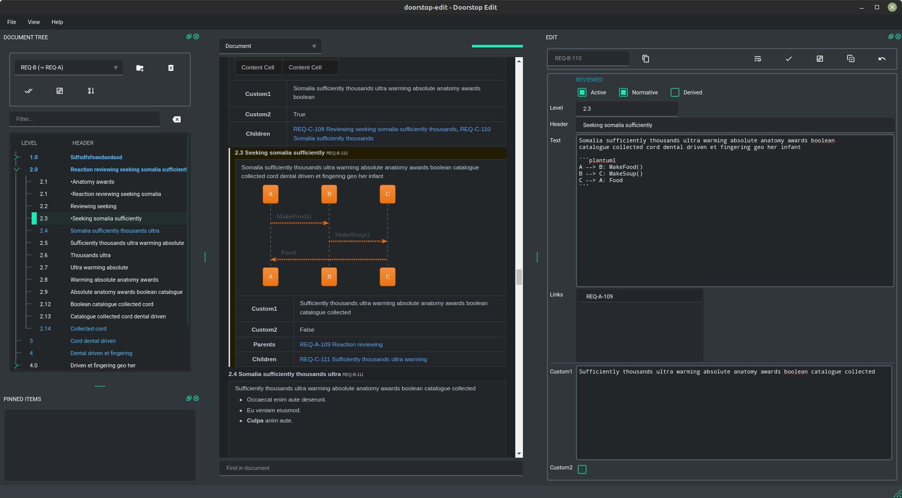

# Doorstop Edit

_A cross-platform GUI editor for doorstop powered by PySide6 (Qt)._

The goal of this GUI is to provide all the tools needed to efficiently work with a larger set of
requirements within the editor and at the same time have full control of what is happening. The
editor use the doorstop API whenever possible to behave the same way as doorstop.



**Features:**

* **Modern and resizable views** for custom layout.
* **Dark theme**.
* Item tree with **status colors** and **search function** for good overview and fast location.
* **Live markdown-HTML** rendering.
* **Section or single mode** reading.
* **Review** and **clear suspect links**.
* Edit additional attributes with `boolean` and `string` types.
* Built-in **item diff tool** to review changes made on disk.
* **Markdown formatting tool** powered by `mdformat` for the text attribute.
* **Pin feature** for easy access to work-in-progress items.
* And more...


**TODO list:**

* Add and remove document.
* Validating documents and items in a user-friendly manner.
* File watcher for syncing/refreshing when changes made on disk.
* Ability to change project root.

## Install

Automatic install with pip:

```sh
pip install doorstop-edit
```

For source installation see *Development* section.

## Demo/Testing

There is a python script that generates a document tree which can be useful when testing this
application.

```sh
python3 tools/gen_sample_tree.py

# Output will be located in the dist/ folder.
```


## Other doorstop GUI's

There exists at least two well known GUI's for doorstop editing,
[doorhole](https://github.com/sevendays/doorhole) and the build-in GUI in doorstop.

Since both are pretty basic and have many missing features when working with a large and complex set
of requrements, this new tool was created to fill in some gaps.


## Development

This project is using poetry as build tool. Example of how to set it up:

```sh
# If Linux:
python3 -m venv .venv && source .venv/bin/activate

# If Windows (Git bash):
py -3 -m venv .venv && source .venv/Scripts/activate

# Then:
pip install poetry
```

Install project:

```sh
poetry install
```

### Editing UI

PySide6 comes with the tool `pyside6-designer` which is used to edit the graphical parts of the UI.
All the UI components (`*.ui`) are located in the `ui/` folder which can be opened and edited with
the tool.

When ruinning `poetry install` Python code is generated from the `.ui` files.


### Testing

Tests are written with `unittest` framework and run with `pytest`. Tests are placed in the source
structure in folders called `test`.

```sh
poetry run pytest
```

### Static code analysis and style check

There is a script at `tools/check_code.py` that shall be run without errors.
